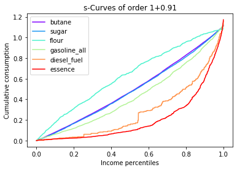
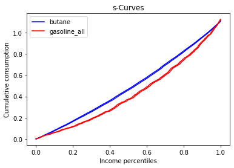

# Fractional dominance for $s$-concentration curves

---

### Fractional dominance is a method to find the best indirect tax reforms

In this package, we find:

  * Draw $s$-curves with a given fractional dominance order
  * Compute critical ratios of costs of funds at the poverty line 
  * Minimal fractional dominance order for $s$-curves dominance
  * Find the crossing point between $s$-curves (percentiles)
  * Find the crossing point between $s$-curves (percentiles) for fixed gamma (ratio of costs)
  * Confidence intervals for $s$-curves


### Libraries
* numpy
* pandas
* matplotlib


### Import Fractional Dominance

```python
from Fractional import FractionalDominance
import pandas as pd
```

### Import data and organize the data (X = consumption y =  incomes)

```python
base = pd.read_csv('primomaroc.csv', sep=',')
X = base[['butane', 'sugar', 'flour', 'gasoline_all', 'diesel_fuel', 'essence']]
y = base['incomes']
```

### Fit the model (the function returns an array with all $s$-curves)

```python
model = FractionalDominance()
fractional_param = 0.91
dominance_param = 1
results = model.fit(X, y, dominance_param = dominance_param, fractional_param = fractional_param)
```

### Print the $s$-curves

```python
model.graph_all()
```


### Test for dominance between all commodities

```python
model.test_dominance_all()
```
|               | butane | sugar | flour | gasoline_all | diesel_fuel | essence |
|---------------|--------|-------|-------|--------------|-------------|---------|
| butane        |        | cross | cross | cross        | 1           | 1       |
| sugar         | cross  |       | cross | cross        | 1           | 1       |
| flour         | cross  | cross |       | cross        | 1           | 1       |
| gasoline_all  | cross  | cross | cross |              | 1           | 1       |
| diesel_fuel   | 0      | 0     | 0     | 0            |             | cross   |
| essence       | 0      | 0     | 0     | 0            | cross       |         |

### Find the critical ratios of costs of funds at the poverty line (z = 0.5*median(incomes))
* First Table: critical ratios at z
* Second Table: Percentiles where the $s$-curves cross

```python
model.critical_ratios_poverty()
```
|               | butane    | sugar     | flour     | gasoline_all | diesel_fuel | essence    |
|---------------|-----------|-----------|-----------|--------------|-------------|------------|
| butane        |           | cross     | cross     | cross        | 4.439557    | 6.074869   |
| sugar         | cross     |           | cross     | cross        | 4.118908    | 5.63611    |
| flour         | cross     | cross     |           | cross        | 9.314213    | 12.745108  |
| gasoline_all  | cross     | cross     | cross     |              | 3.311577    | 4.531398   |
| diesel_fuel   | 4.439557  | 4.118908  | 9.314213  | 3.311577     |             | cross      |
| essence       | 6.074869  | 5.63611   | 12.745108 | 4.531398     | cross       |            |


|               | butane    | sugar     | flour     | gasoline_all | diesel_fuel | essence    |
|---------------|-----------|-----------|-----------|--------------|-------------|------------|
| butane        |           | 0.986406  | 0.976196  | 0.027366     |             |            |
| sugar         | 0.986406  |           | 0.979224  | 0.006945     |             |            |
| flour         | 0.976196  | 0.979224  |           | 0.981123     |             |            |
| gasoline_all  | 0.027366  | 0.006945  | 0.981123  |              |             |            |
| diesel_fuel   |           |           |           |              |             | 0.009142   |
| essence       |           |           |           | 0.009142     |             |            |

* Third Table: for a fixed gamma this returns the percentile below which dominance is respected
```python
model.critical_ratios_poverty(gamma = 3)
```
|               | butane   | sugar    | flour    | gasoline_all | diesel_fuel | essence   |
|---------------|----------|----------|----------|--------------|-------------|-----------|
| butane        |          |          |          |              | 0.502315    | 0.707111  |
| sugar         |          |          |          |              | 0.527484    | 0.699454  |
| flour         |          |          |          |              | 0.544996    | 0.759646  |
| gasoline_all  |          |          |          |              | 0.12359     | 0.640152  |
| diesel_fuel   | 0.502315 | 0.527484 | 0.544996 | 0.12359      |             |           |
| essence       | 0.707111 | 0.699454 | 0.759646 | 0.640152     |             |           |


### Find the minimal fractional order (from dominance_param to dominance_param + 1)

```python
model.minimal_frac_dominance_all()
```
|               | butane | sugar | flour | gasoline_all | diesel_fuel | essence |
|---------------|--------|-------|-------|--------------|-------------|---------|
| butane        | 0.00   | 0.00  | 0.00  | 0.00         | 0.0         | 0.0     |
| sugar         | 1.94   | 0.00  | 0.00  | 0.00         | 0.0         | 0.0     |
| flour         | 1.97   | 1.97  | 0.00  | 0.00         | 0.0         | 0.0     |
| gasoline_all  | 0.00   | 0.00  | 1.98  | 0.00         | 0.0         | 0.0     |
| diesel_fuel   | 1.87   | 1.87  | 1.91  | 1.82         | 0.0         | 0.0     |
| essence       | 1.88   | 1.88  | 1.91  | 1.85         | 0.0         | 0.0     |


### Graph two $s$-curves

```python
model.graph("butane", "essence")
```


### Confidence intervals of $s$-curves
```python
s_curve_butane = results[0,:]
s_curve_gasoline_all = results[3,:]
CI_butane = model.bootstrap(s_curve_butane, confidence_interval = 0.99, B = 500)
CI_gasoline_all = model.bootstrap(s_curve_gasoline_all, confidence_interval = 0.99, B = 500)
```

